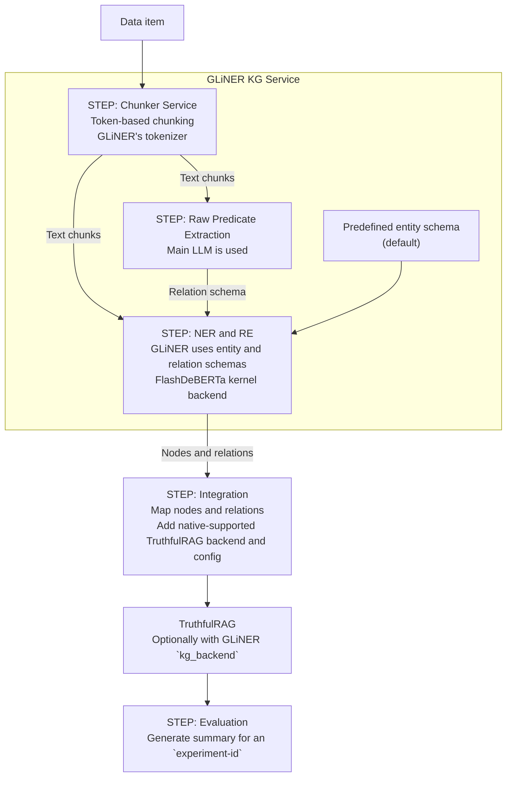

# TruthfulRAG

## TruthfulRAG Service

### Quick Start

Recommended to create a clean environment (for now)
- `conda create -n truthful-rag-service python=3.11`
- `conda activate truthful-rag-service`
- `pip install -r app/requirements.txt`
- `make start`

---

## KG Building

* drop-in replacement for the LLM KG building module in TruthfulRAG

---

## Architecture

### Models

- main LLM: `Qwen/Qwen2.5-7B-Instruct`
- GLiNER: `knowledgator/gliner-relex-large-v0.5`

---

### Details

- sync design without introducing additional hardware dependencies

* `STEP: Chunker Service`
    * token-based chunking with overlap
    * tokens are given from GLiNER's tokenizer
    * conceptually same as the one in TruthfulRAG

* `STEP: Raw Predicate Extraction`
    * main LLM performs batched-raw predicate extraction from text chunks

* `STEP: NER and RE`
    * GLiNER performs NER and RE based on the pre-defined entities and relations schemas
    * Batched inference with full-precision weights and optimized `FlashDeBERTa` kernel backend

* `STEP: Integration`
    * `adapter.py` for integration into `TruthfulRAG`
    * native-support by customized `kg_backend` and `gliner_kg_service_config`

* `STEP: Evaluation`
    * `eval.py` for report generation with summaries for the experimental runs

---

### Structure

| Script                                   | Description                                            | 
|------------------------------------------|--------------------------------------------------------|
| `core/env_manager.py`                    | Environment management                                 | 
| `prompts/predicate_extraction_prompt.md` | Prompt for raw predicate extraction                    | 
| `adapter.py`                             | Integration entrypoint for `TruthfulRAG`               |
| `main.py`                                | Running experiments                                    |
| `services/eval.py`                       | Report generator for final summary of experiments      |
| `kg_building.ipynb`                      | Clean implementation of the KG Building method         |
| `deprecated/`                            | Implemented but currently unused services              |
| `services/chunk_service.py`              | Service for chunking by token size (GLiNER tokenizer)  |
| `services/llm_service.py`                | LLM-backend service for predicate extraction           |
| `services/ner_re_service.py`             | GLiNER-backend service for KG creation                 |
| `services/kg_service.py`                 | Orchestrator entrypoint for all services               |
| `services/helpers.py`                    | Helpers for downloading, loading and offloading models |

---

### Preliminary Results

- pilot study (first 15 items from `timeqa_2022_nota.json`)
- **hardware** - A100 40GBs hosted on Colab

#### GLiNER

##### Quality

| num_items | exact_match |      acc |       f1 |
|----------:|------------:|---------:|---------:|
|        15 |    66.6667% | 66.6667% | 66.6667% |

##### Runtime

|    Total | KG Building | KG Retrieval | Entropy Filter | Prediction + Eval | Paths | Filtered Paths |
|---------:|------------:|-------------:|---------------:|------------------:|------:|---------------:|
| 159.73 s |     62.22 s |      46.66 s |         8.53 s |           42.32 s |    92 |             64 |

##### Runtime-average

| KG Building - per item | KG Retrieval - per item | Entropy Filter - per item | Prediction + Eval - per item | Paths - per item | Filtered Paths - per item |
|-----------------------:|------------------------:|--------------------------:|-----------------------------:|-----------------:|--------------------------:|
|                 4.15 s |                  3.11 s |                    0.57 s |                       2.82 s |             6.13 |                      4.27 |

---

#### Qwen

##### Quality

| num_items | exact_match |      acc |       f1 |
|----------:|------------:|---------:|---------:|
|        15 |    80.0000% | 80.0000% | 80.0000% |

##### Runtime

|     Total | KG Building | KG Retrieval | Entropy Filter | Prediction + Eval | Paths | Filtered Paths |
|----------:|------------:|-------------:|---------------:|------------------:|------:|---------------:|
| 1754.06 s |   1648.37 s |      51.65 s |        12.21 s |           41.82 s |    93 |             79 |

##### Runtime-average

| KG Building - per item | KG Retrieval - per item | Entropy Filter - per item | Prediction + Eval - per item | Paths - per item | Filtered Paths - per item |
|-----------------------:|------------------------:|--------------------------:|-----------------------------:|-----------------:|--------------------------:|
|               109.89 s |                  3.44 s |                    0.81 s |                       2.79 s |             6.20 |                      5.27 |

---

#### Baselines

##### Quality

|                                  Method | num_items | exact_match |      acc |       f1 |
|----------------------------------------:|----------:|------------:|---------:|---------:|
|                         `w/o` RAG + cot |        15	 |    20.0000%	 | 20.0000%	 | 22.6667% |
| `w/o` RAG + wo_cot (**paper baseline**) |        15	 |    26.6667%	 | 26.6667%	 | 31.1111% |
|                               RAG + cot |        15 |    66.6667%		 | 66.6667% | 70.0000% |
|      RAG + wo_cot  (**paper baseline**) |        15 |    73.3333%		 | 73.3333% | 76.6667% |

---

### Comparison

* `TruthfulRAG-GLiNER-KG` is retaining 83.3% of the accuracy of the original `TruthfulRAG`
* `TruthfulRAG-GLiNER-KG` is ~ 11x faster than the original `TruthfulRAG`
* KG-construction is approximately 26.5x faster with `GLiNER-backend` than with `LLM-backend`
* `TruthfulRAG-GLiNER-KG` is on-par with RAG + cot

---

### Experimental Design

* `timeqa_2022`

* **RQ1** Can we replicate the reported results from the paper?
    * TruthfulRAG with `Qwen`
    * `w/o` RAG
    * RAG

* **RQ2** How does GLiNER-based KG building compares with LLM-driven KG building within TruthfulRAG?
    - `GLiNER-KG`
    - `Qwen-KG`

* **RQ3** What is the connection between KG paths and QA accuracy?
    - Ablation Study
        - final context -> paths (`GLiNER-KG`) vs paths (`GLiNER-KG`) + context
        - final context -> only paths (`Qwen-KG`) vs paths (`Qwen-KG`) + context

* **RQ4** What are the practical challenges when integrating GLiNER-based KG pipeline into TruthfulRAG as a deployable
  service?
    - Deployable Service
    - Requests with
        - `w/o` RAG
        - RAG
        - KG

---

### Contributions

- **GLiNER**
    - implemented GLiNER-backend with a custom pipeline
    - integrated into `TruthfulRAG` i.e. a new `generate_knowledge_graph` step

- **TruthfulRAG**
    - fixes for stable experiments
        - fixes in `elements_list`
        - answer parsing issues

- **Experiments**
    - see _Experimental Design_

- **Promising Directions**
    - quality improvements
        - LLM agentic refinement of graph
        - Deduplication and Linking
        - Optimizing GLiNER thresholds
    - runtime improvements
        - GLiNER integration with `https://pypi.org/project/disentangled-flash/` i.e. custom `flash-attn` kernel for the
          `DeBERTa` encoder

---