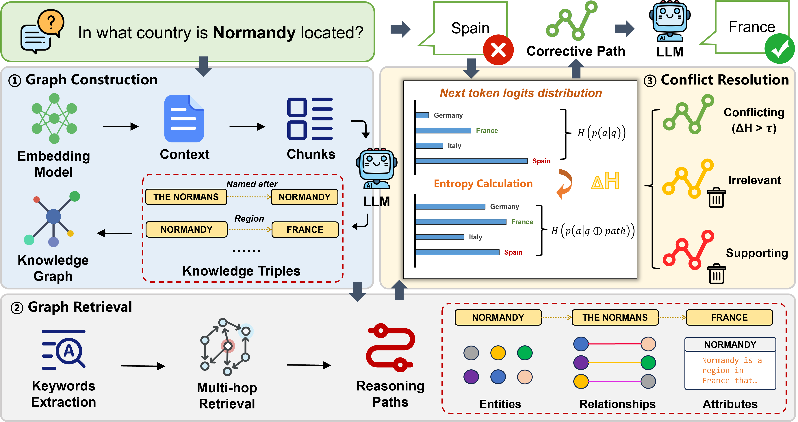

# TruthfulRAG
This repo contains the code and data for **TruthfulRAG: Resolving Factual-level Conflicts in Retrieval-Augmented Generation with Knowledge Graphs**. The first framework that leverages Knowledge Graphs (KGs) to resolve factual-level knowledge conflicts in RAG systems.



## Usage
### 1. Dependencies
Run the following command to install the dependencies:
```shell
pip install -r requirements.txt
```
### 2. Quick Start

You could directly run the following command for a quick start:
```shell
python openai_demo.py
python hf_demo.py
```

You could also run the following code to customize your own pipeline in test.ipynb:
```python
import os
from datasets import load_dataset
from truthfulrag import TruthfulRAG

# Load dataset
dataset_name = 'faitheval_data'
dataset = load_dataset("json", data_files=f"./datas/{dataset_name}.json")
dataset = dataset['train']

# Initialize TruthfulRAG pipeline

os.environ["CUDA_VISIBLE_DEVICES"] = ""
os.environ["OPENAI_API_KEY"] = ""
os.environ["OPENAI_BASE_URL"] = ""

rag = TruthfulRAG(
    dataset=dataset,
    backend_type="openai",  # or "hf", "openai"
    model_name="gpt-4o-mini", # Mistral-7B-Instruct-v0.3, Qwen2.5-7B-Instruct
    similarity_model="all-MiniLM-L6-v2",
    output_dir="./results",
    working_dir="./kg_cache",
    threshold=1
)

import asyncio

async def run_pipeline():
    elements_list = []
    for item in dataset:
        # Generate KG
        await rag.make_knowledge_graph(item)
    
        # Retrieve related entities and relationships
        elements = await rag.knowledge_graph_retrieve(item)
        filtered_elements = await rag.entropy_based_filter(sample=item, elements=elements)
        elements_list.append({"id": item['id'], "element": filtered_elements})
    
    # Generate predictions
    predictions = await rag.get_predictions(
        dataset, 
        elements_list,
        generation_type="cot"
    )
    print("predictions: ", predictions)
    
    # Evaluate results
    results = rag.evaluate(dataset, predictions, cot_format=True)
    print("Evaluation Results:")
    print(f"Exact Match: {results['exact_match']:.2f}%")
    print(f"Accuracy: {results['acc']:.2f}%")
    print(f"F1 Score: {results['f1']:.2f}%")

try:
    loop = asyncio.get_running_loop()
except RuntimeError:
    asyncio.run(run_pipeline())
else:
    await run_pipeline()
```

## 引用
```bibtex
@article{liu2025truthfulrag,
  title={TruthfulRAG: Resolving Factual-level Conflicts in Retrieval-Augmented Generation with Knowledge Graphs},
  author={Liu, Shuyi and Shang, Yuming and Zhang, Xi},
  journal={arXiv preprint arXiv:2511.10375},
  year={2025}
}
```


## 关于我们

STAIR (Secure and Trustworthy AI Research) 团队隶属于北京邮电大学网络空间安全学院和可信分布式计算与服务教育部重点实验室。团队主要研究安全可信人工智能技术，及在网络空间治理领域的应用，近年来在网络内容与行为分析、大模型安全等方面承担了国家重点研发计划等多项重要科研任务。

**联系我们**

zhangx@bupt.edu.cn
